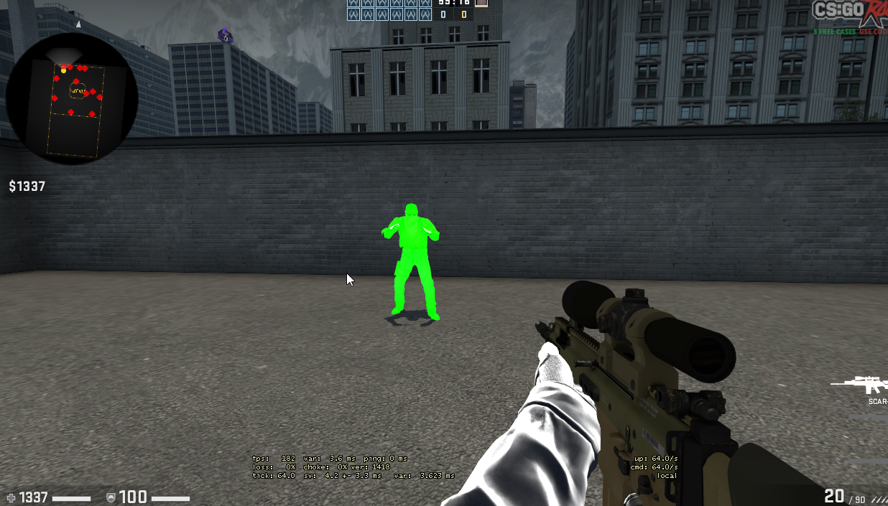

<h2 align="center"> coffee </h2>

   

      
    

# shit and piss 
windows only external cheat, i wouldn't recommend learning off this as the code is very bad.
only features right now are chams and nightmode

